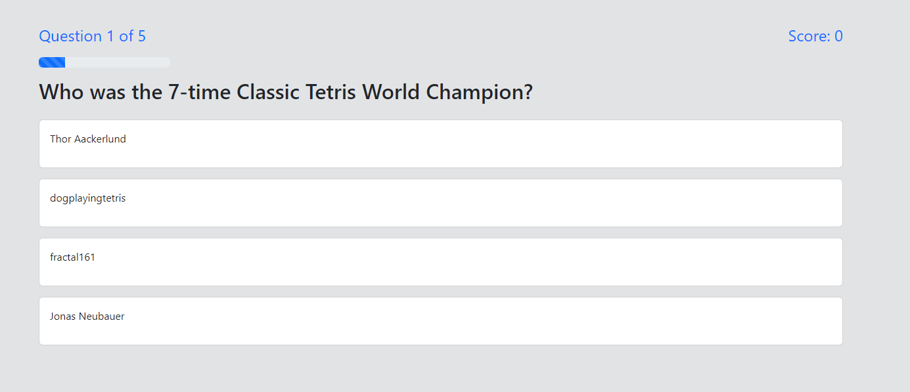

# NES Tetris Quiz App

This repository contains the code for a quiz app that tests your knowledge of the events and records that happened involving the NTSC release of Tetris for the NES. The app is built using BootStrap 5 and JavaScript. It includes only 5 questions and 4 answer choices for each question. The user will be able to save their scores to local storage and view them on the high scores page. The app is fully responsive and will work on any device. You can view the app <a href="https://quiz-app-030o.onrender.com" target="_blank">here</a>.